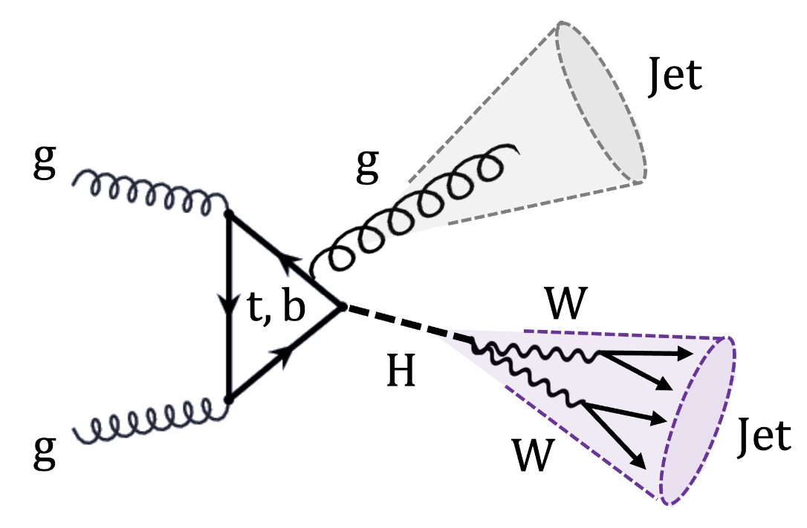

# boostedHWW

<!-- <p align="left">
  
</p> -->




Search for boosted(high transverse momentum) Higgs boson(H) decaying to two W bosons, with the decay product in a single large radius jet. The majority of the analysis
uses [nanoAOD-tools](https://github.com/cms-nanoAOD/nanoAOD-tools), [coffea](https://coffeateam.github.io/coffea/) and
[scikit-hep](https://scikit-hep.org) Python libraries to process input tree-based
[NanoAOD](https://twiki.cern.ch/twiki/bin/view/CMSPublic/WorkBookNanoAOD) files.

- [boostedHWW](#boostedhww)
  - [Preprocessing](#preprocessing)
    - [MiniAOD to Ntuple(e.g., submit condor jobs on CMSconnect)](#miniaod-to-ntupleeg-submit-condor-jobs-on-cmsconnect)
    - [Ntuple to PKUTree](#ntuple-to-pkutree)
    - [PKUTree to SlimmedTree](#pkutree-to-slimmedtree)
  - [Postprocessing](#postprocessing)
    - [show prefit results:](#show-prefit-results)
    - [save distribution histograms:](#save-distribution-histograms)
    - [show variation with respect to different systematic uncertainties:](#show-variation-with-respect-to-different-systematic-uncertainties)
  - [Combine](#combine)
    - [CMSSW + Combine Quickstart](#cmssw--combine-quickstart)
    - [Packages](#packages)
    - [Create Datacards](#create-datacards)
    - [Run fits and diagnostics locally](#run-fits-and-diagnostics-locally)
    - [Perform GoF](#perform-gof)
  
## Preprocessing
Firstly, we run a set of necessary processors to get the flat tree files that we finally used in the analysis.
### MiniAOD to Ntuple(e.g., submit condor jobs on [CMSconnect](https://connect.uscms.org))
In `preprocessing/nano_to_ntuple`, [XWWNano](https://github.com/StephenChao/XWWNano) framework is used to produce tuple files from customized [NanoAOD](https://twiki.cern.ch/twiki/bin/view/CMSPublic/WorkBookNanoAOD). Note that [MiniAOD](https://twiki.cern.ch/twiki/bin/view/CMSPublic/WorkBookMiniAOD) is initially used to derive the customized NanoAOD, implementing the ParticleTransformer taggers.
1. Update `voms` certificate
```bash
voms-proxy-init -voms cms -valid 192:00
```
2. Create json files, get official MiniAOD path on DAS, e.g.,
```bash
python condor.py --DAS DAS_2018_Signal --Filesjson "./json/2018_HWW_Signal.json" --createfilejson 
```
3. Create condor job files, e.g.,
```bash
python condor.py --DAS DAS_2018_Signal  --Filesjson "./json/2018_HWW_Signal.json"  --outputPath "/ospool/cms-user/yuzhe/NtupleStore/V3/2018/Signal"  --year 2018  --excutable "exe_UL18_NanoNtupleChain.sh" --TaskFolder "production/NanoNtupleChain_16_Feb_2024" --submitsh "NanoNtupleChain_16_Feb_2024.sh" --Condor --AddtionalArgs "-a '-o ./ -M HWW -m --year 2018'"
```
4. Submit condor jobs.

### Ntuple to PKUTree
In `preprocessing/ntuple_to_tree`, a C++ and ROOT framework is used to further convert the tuple to flat tree. Higgs candidate jet is also selected from this step.

1. Set up environment:
```bash
source /cvmfs/cms.cern.ch/cmsset_default.sh
cmsrel CMSSW_10_6_27
cd CMSSW_10_6_27/src
cmsenv
```
2. To compile, run:
```bash
root -l
.L EDBR2PKUTree.C++
```
3. Convert the tuple files to tree files:
```bash
python TransMergedMC.py
```
### PKUTree to SlimmedTree
In `preprocessing/tree_to_slimmed`, the tree files are further cleaned, some scale factors(SFs) can also be applied in this step, e.g., HLT trigger SFs.
1. Set up environment:
```bash
conda env create -f slim.yml
conda activate slim
```
2. Convert the tree files to slimmed tree files:
```bash
python runSlimmedTree.py
```

## Postprocessing
After processing the NanoAOD files, all kinds of variable distribution can be shown, e.g., jet mass. We can also save the histograms to `.pkl` templates and then use it later. 

### show prefit results:
Use file `./postprocessing/makeplots.ipynb`
### save distribution histograms:
Use file `./postprocessing/templates.ipynb`
### show variation with respect to different systematic uncertainties:
Use file `./postprocessing/variation.ipynb`

## Combine

### CMSSW + Combine Quickstart

```bash
source /cvmfs/cms.cern.ch/cmsset_default.sh
cmsrel CMSSW_11_3_4
cd CMSSW_11_3_4/src
cmsenv
git clone -b v9.2.0 https://github.com/cms-analysis/HiggsAnalysis-CombinedLimit.git HiggsAnalysis/CombinedLimit
git clone -b v2.0.0 https://github.com/cms-analysis/CombineHarvester.git CombineHarvester
scramv1 b clean; scramv1 b
```


### Packages

To create datacards, you need to use the same cmsenv as above + these packages:

```bash
pip3 install --upgrade pip
pip3 install rhalphalib
cd /path/to/your/local/boostedHWW/repo
pip3 install -e .
```

### Create Datacards
Need `root==6.22.6` and `rhalphalib` installed. Enter `./combine`

```bash
python3 -u ./create_datacard.py --model-name nTFa_3_nTFb_6 --templates-dir ../postprocessing/templates/25Jun2024_sig_qcd --nTFa 3 --nTFb 6 --cards-dir .
```

### Run fits and diagnostics locally

All via the below script, with a bunch of options (see script):

```bash
./combine/scripts/run_blinded.sh --workspace --bfit --limits
```

### Perform GoF
Via file `./combine/scripts/run_ftest.sh` and `./combine/scripts/run_blinded.sh`

